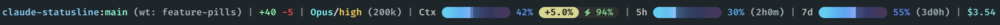

# claude-statusline

A status line for [Claude Code](https://claude.com/claude-code) that keeps a long session's vital signs in view: context usage, how much your last prompt added, rate limits, cost, and cache hits. It adapts to your window width and to whether you are on a subscription plan or straight API keys.



Written up in [Put Your Claude Code Session's Vital Signs in the Status Line](https://zerofaultlabs.io/) on the ZeroFault Labs blog, which covers why each number is there.

## What it shows

| Segment | Meaning |
| --- | --- |
| `repo:branch` | A `(wt: name)` appears only when the worktree name differs from the branch. |
| `+N -N` | Lines added and removed this session. |
| `Model/effort (size)` | Effort is colored from cool to hot: low and medium use the theme color, high is yellow, xhigh orange, max red. |
| `Ctx ▌▌▌▌▌ NN%` | Context usage as a gradient pill bar. The bar and the percentage take their color from how full the window is. |
| Growth pill `+N%` | How much context your last prompt added, as a percent of your window (or tokens). Its color steps from light to heavy over eight levels. |
| Cache inset `⚡ NN%` | The lowest cache hit rate since your last prompt, so a cold-cache call stays visible after the next call warms it back up. |
| `5h` and `7d` | Rate-limit bars with time until reset. Plan accounts only. |
| `$X.XX` | Session cost. With API billing it becomes a pill that steps through the growth colors as the bill grows. |
| Token total | New input + cache writes + output for the session, no cache reads. Counted incrementally from the transcript, so it stays fast in long sessions. |

Every segment appears only if Claude Code reports its data. In a new session the usage figures are not available until the first response, so Ctx shows as 0% and the last known 5h and 7d are reused until fresh ones arrive.

## Install

Requires `bash`, `jq`, `git`, `python3`, and **a Nerd Font set as your terminal font**. The pills, the bolt, and the rounded caps are Nerd Font glyphs; without one you will see empty boxes. Developed on macOS; Linux should work but is less tested.

**Nerd Font.** If you do not have one, [JetBrainsMono Nerd Font](https://www.nerdfonts.com/font-downloads) is a good default. On macOS: `brew install --cask font-jetbrains-mono-nerd-font`. Then select it in your terminal's font settings (installing it is not enough). The install prompt below will offer to do the first part for you.

**With Claude Code.** Open a session and paste the prompt from [`INSTALL_PROMPT.md`](INSTALL_PROMPT.md). It reads the scripts, checks your font and tools, asks before installing anything, merges your settings without overwriting anything, and tests against fake data.

**By hand.**

```bash
git clone https://github.com/zerofaultlabs/claude-statusline.git
cp claude-statusline/statusline-command.sh claude-statusline/statusline-ctxbar.py claude-statusline/statusline-hook.sh ~/.claude/
cp claude-statusline/statusline.conf.example ~/.claude/statusline.conf   # optional
```

Then add this to `~/.claude/settings.json`, merging with what is already there:

```json
"statusLine": {"type": "command", "command": "bash ~/.claude/statusline-command.sh"},
"hooks": {"UserPromptSubmit": [{"hooks": [{"type": "command", "command": "bash ~/.claude/statusline-hook.sh"}]}]}
```

Read the scripts first. They are short, and they run on every refresh.

## Configure

Settings live in `~/.claude/statusline.conf`. Copy [`statusline.conf.example`](statusline.conf.example) and uncomment what you want to change. Every setting is optional, and a value that is not valid falls back to its default. Changes apply on the next refresh (after your next message or when the current turn ends), with no restart.

| Setting | Values | What it does |
| --- | --- | --- |
| `STATUSLINE_THEME` | `sorbet` (default), `ember`, `sunset` | Recolors the whole line: bars, growth pill, cache inset, and text. |
| `STATUSLINE_LAYOUT` | `compact` (default), `wrap`, `full` | What to do when the window is too narrow (see below). |
| `STATUSLINE_BG` | `dark` (default), `light` | Light mode is minimal: darker text and a pale bar track and inset. |
| `BILLING` | `auto` (default), `plan`, `api` | `api` hides 5h and 7d and puts the cost in a colored pill. |
| `GROWTH_SHOW` | `percent` (default), `tokens`, `both` | The number in the growth pill. |
| `GROWTH_COLOR_BY` | `percent` (default), `tokens` | `percent` scales the color steps to your context window, so the same prompt reads differently on 200k and 1M. |
| `COST_STYLE` | `auto` (default), `pill`, `text` | `auto` is a pill for API billing and plain text on a plan. Set `pill` to get the pill on a plan too. |
| `SHOW_DIFF`, `SHOW_COST`, `SHOW_TOKENS`, `SHOW_CACHE` | `true`, `false` | Turn a segment off. |
| `SHOW_GIT_COUNTS` | `true`, `false` | Adds staged, unstaged, and ahead counts after the branch. |
| `STATUSLINE_MARGIN` | number | Columns kept free at the right edge. Default 6. |
| `COST_STEPS` | 8 numbers, in cents | Where the cost pill steps to the next color. |

### Try a config

To preview your settings without waiting for a refresh, pipe a sample payload into the script. It reads the same `~/.claude/statusline.conf`, so what you see is what the live line will show:

```bash
echo '{"workspace":{"current_dir":"'"$PWD"'"},"model":{"display_name":"Opus"},"context_window":{"used_percentage":42,"context_window_size":200000,"total_input_tokens":84000,"total_output_tokens":2000,"current_usage":{"input_tokens":500,"cache_creation_input_tokens":2000,"cache_read_input_tokens":80000}},"rate_limits":{"five_hour":{"used_percentage":30,"resets_at":9999999999},"seven_day":{"used_percentage":55,"resets_at":9999999999}},"cost":{"total_cost_usd":1.25,"total_lines_added":40,"total_lines_removed":5}}' | COLUMNS=$(tput cols) bash ~/.claude/statusline-command.sh
```

`$(tput cols)` uses your terminal's current width, so resize the window and run it again to see how the line fits. The live status line does this on its own: the script reads the width on every render and caches none of it. To try a different file without touching your real one, set `STATUSLINE_CONF=/path/to/test.conf` on the same command. The sample has no session id, so the growth pill and cache inset do not appear; use a real session to see those.

### Narrow windows

The script reads your window width from `$COLUMNS` and fits the line to it.

- **compact** keeps everything on one line. If it does not fit, it shortens the bars, then drops things in this order: reset times and window size, token total, cache inset, 7d, diff, 5h, bars to the minimum, worktree name, cost, model. Repo, Ctx, and the growth pill are never dropped.
- **wrap** puts the model and usage on the first line (shrunk the same way if needed) and `repo:branch` with the diff on a second line.
- **full** never shrinks.

### Plan or API keys

With `BILLING=auto`, the 5h and 7d bars appear once your account has reported rate limits. Before that, and for accounts that never do, the line shows cost as a pill instead. Set `plan` or `api` if you want to force it.

## Files

- `statusline-command.sh` renders the line.
- `statusline-ctxbar.py` renders the gradient bars (one Python process per render, at every width the layout might need).
- `statusline-hook.sh` is a `UserPromptSubmit` hook. It snapshots token totals for the per-prompt growth figure, resets the lowest-cache-hit tracker, and deletes state files older than 14 days from `~/.claude/statusline-state/`.
- `statusline.conf.example` lists every setting.

The script also writes `~/.claude/statusline-seen-limits`, an empty marker that records that your account has reported rate limits.

## Limits

- The 5h and 7d segments appear only when Claude Code reports rate-limit data for your plan. A new session shows the last known values until its first response.
- The token total measures work done, not a bill. Use your provider's usage page for money.
- The lowest cache hit rate per prompt does not weigh call size, so one small cold call among large warm ones still shows low.
- A session resumed after 14 days rebuilds its token total on the next render: correct, but slower once.
- Light mode is a minimal adaptation, not a full theme set.

## Share yours

Added a segment or a theme you can't live without? Open an issue or start a discussion and tell me what it is. The best additions may make it into the script.

## License

[MIT](LICENSE)
